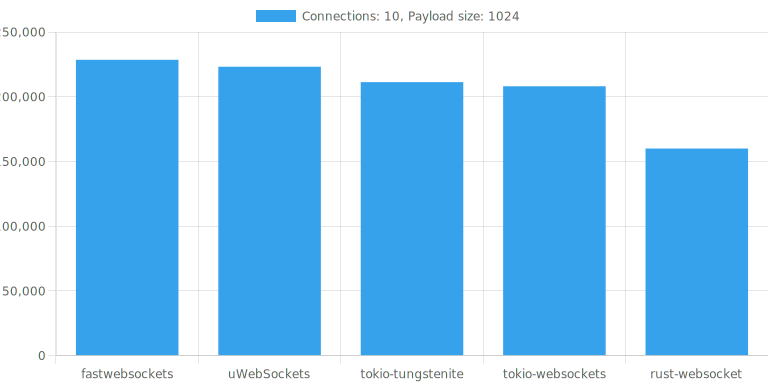
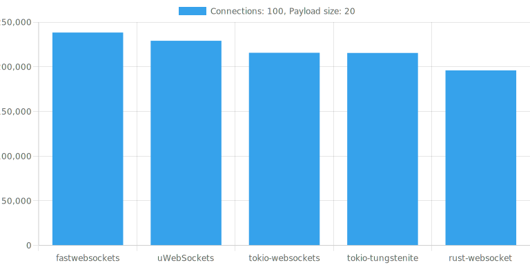
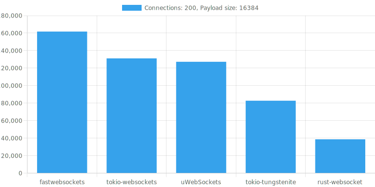
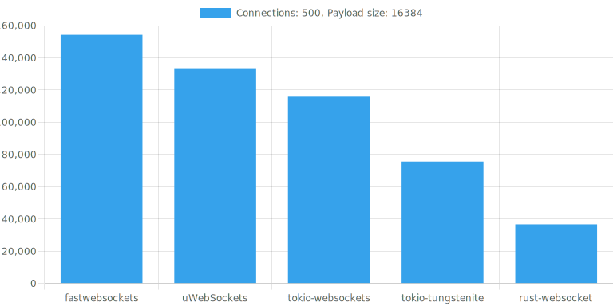

# Benchmarks

It is a bit tricky to benchmark WebSocket libraries, since you're going to be limited by the speed of the slower end (i.e. benchmarking a server requires an even faster client and vice-versa). The [uWebSockets](https://github.com/uNetworking/uWebSockets) library for C/C++ comes with a benchmarking tool called `load_test` that should be fast enough not to bottleneck all currently known WebSocket library implementations and has been used for these benchmarks.

## Environment

I run these benchmarks irregularly on my main system (CPU: `AMD Ryzen 9 7950X`, RAM: `32GB`). The kernel version last used is:

```
$ uname -a
Linux ceres 6.7.0-0.rc3.20231129gt18d46e76.329.vanilla.fc39.x86_64 #1 SMP PREEMPT_DYNAMIC Wed Nov 29 06:20:06 UTC 2023 x86_64 GNU/Linux
```

and the benchmarks are run in a podman container based on Alpine Linux Edge.

## Methodology

We're comparing some popular Rust WebSocket libraries to tokio-websockets and uWebSockets as a reference. All of the implementations are asynchronous. For benchmarking we use a simple plaintext echo server.

In order to bottleneck faster, we're also using a single-threaded runtime.

The following libraries are compared (in alphabetical order):

* fastwebsockets ([unsound and not thread-safe](https://github.com/denoland/fastwebsockets/issues/42), *non-strict* spec compliance)
* rust-websocket (uses EOL tokio 0.1, *non-strict* spec compliance)
* tokio-tungstenite (*non-strict* spec compliance)
* tokio-websockets (*strict* spec compliance)
* uWebSockets (*non-strict* spec compliance)

The benchmarking script was taken from [fastwebsockets](https://github.com/denoland/fastwebsockets/tree/main/benches) and modified.

## Results

### 10 connections, 1024 byte payloads



### 10 connections, 16384 byte payloads


### 100 connections, 20 byte payloads



### 200 connections, 16384 byte payloads



### 500 connections, 16384 byte payloads


