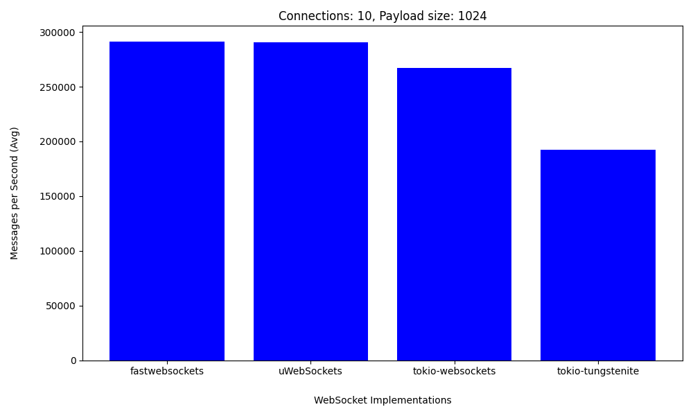
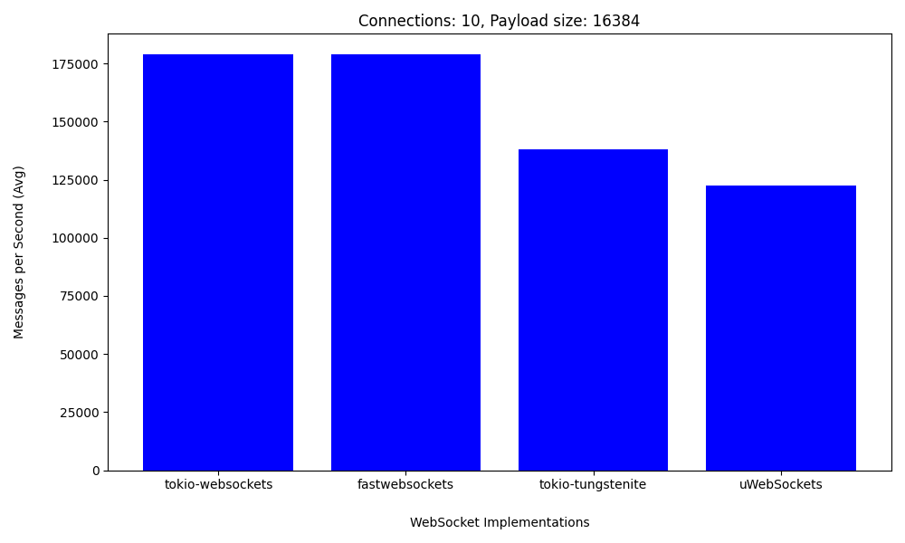
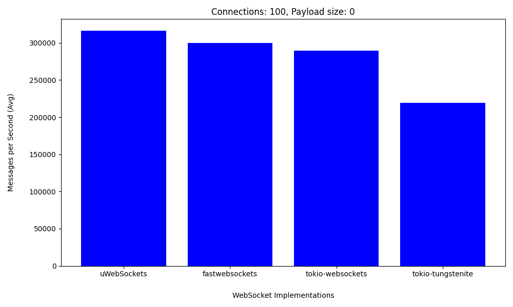
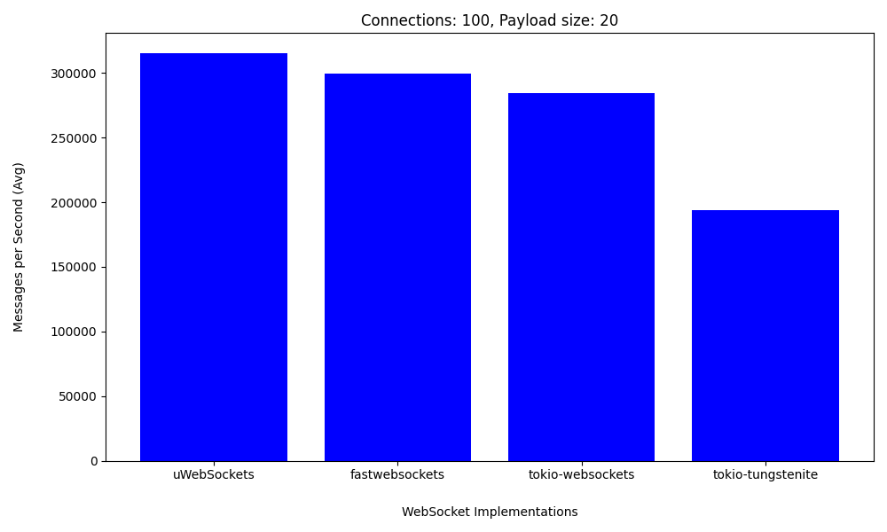
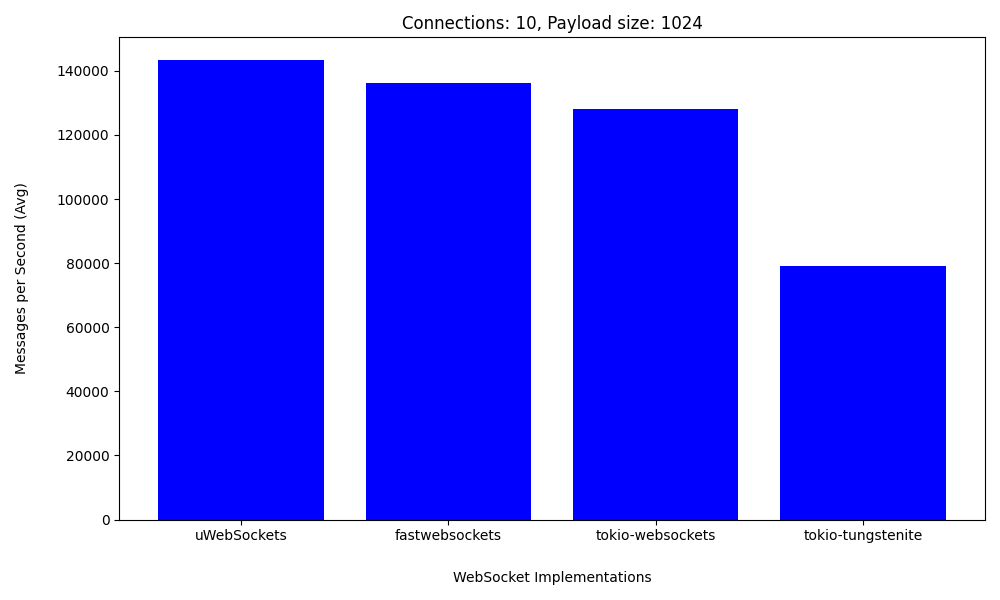
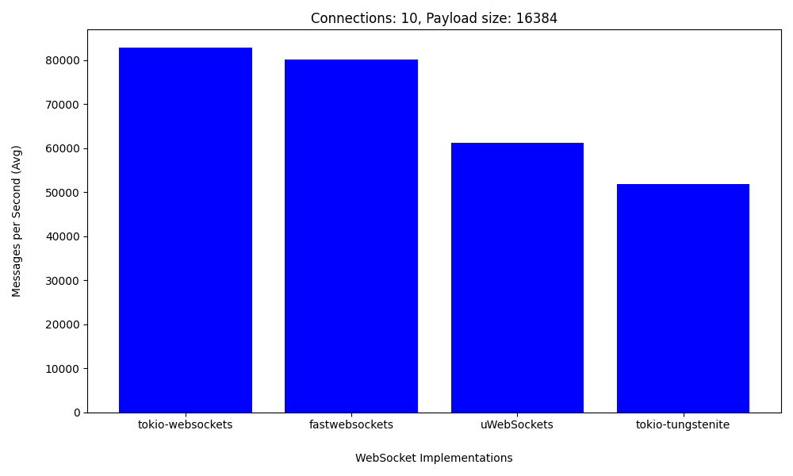
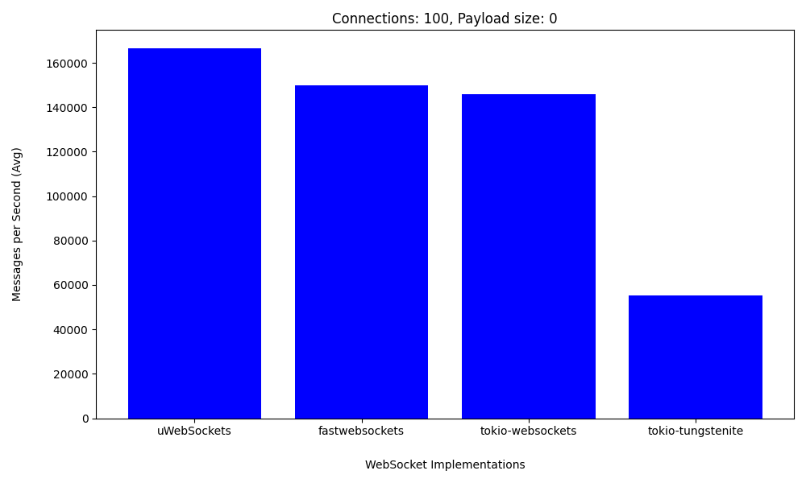
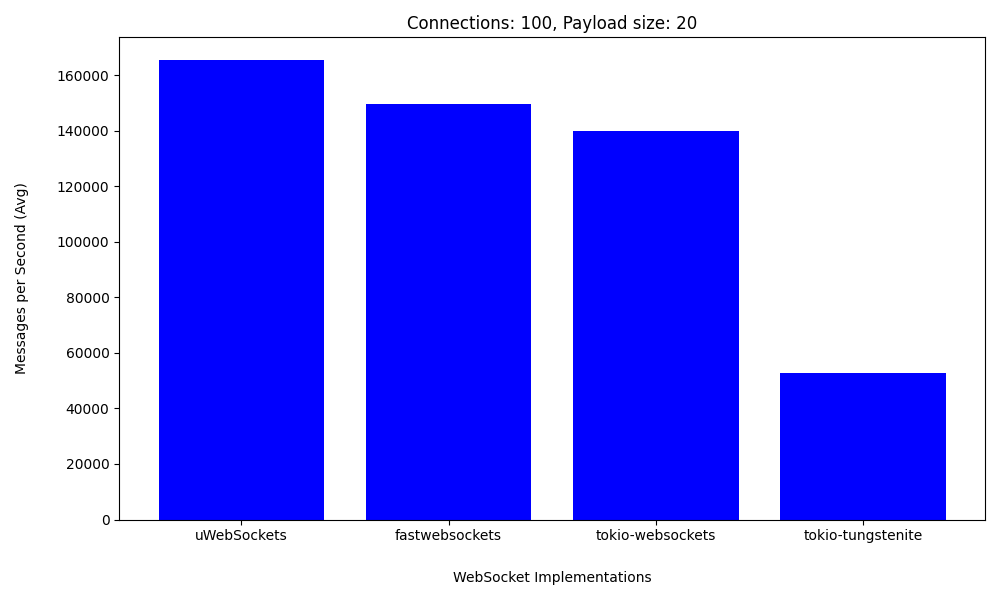
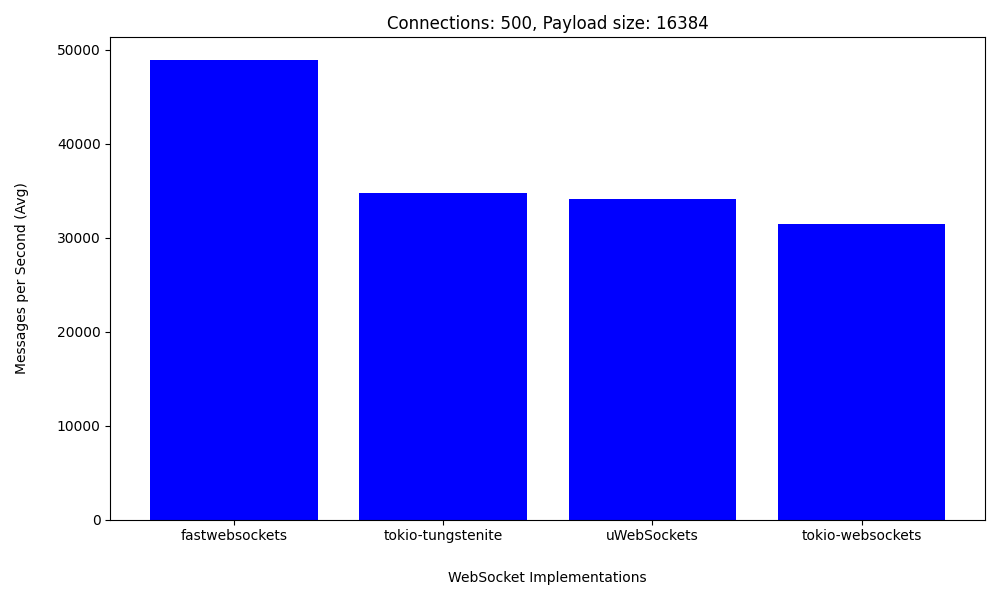

# Benchmarks

It is a bit tricky to benchmark WebSocket libraries, since you're going to be limited by the speed of the slower end (i.e. benchmarking a server requires an even faster client and vice-versa). The [uWebSockets](https://github.com/uNetworking/uWebSockets) library for C/C++ comes with a benchmarking tool called `load_test` that should be fast enough not to bottleneck all currently known WebSocket library implementations and has been used for these benchmarks.

## Environment

The benchmarks are run irregularly on a bunch of different systems to get a rough idea for the scaling of the library on different hardware. All hardware is bare-metal, not virtualized.

All benchmarks are run in a podman container based on Chimera Linux.

## Methodology

We're comparing some popular Rust WebSocket libraries to tokio-websockets and uWebSockets as a reference. All of the implementations are asynchronous. For benchmarking we use a simple plaintext echo server.

In order to bottleneck faster, we're also using a single-threaded runtime.

The following libraries are compared (in alphabetical order):

* fastwebsockets ([unsound and not thread-safe](https://github.com/denoland/fastwebsockets/issues/42), *non-strict* spec compliance)
* tokio-tungstenite (*non-strict* spec compliance)
* tokio-websockets (*strict* spec compliance)
* uWebSockets (*non-strict* spec compliance)

The benchmarking script was taken from [fastwebsockets](https://github.com/denoland/fastwebsockets/tree/main/benches) and modified.

## Results

### AMD Ryzen 9 7950X, Linux 6.13.5

This target uses AVX2 to emulate AVX512 in hardware.

Expand results

#### 10 connections, 1024 byte payloads

#### 10 connections, 16384 byte payloads

#### 100 connections, 0 byte payloads

#### 100 connections, 20 byte payloads

#### 200 connections, 16384 byte payloads

#### 500 connections, 16384 byte payloads

### Rockchip RK3588S2, Linux 6.1.48

This target uses NEON.

Expand results

#### 10 connections, 1024 byte payloads

#### 10 connections, 16384 byte payloads

#### 100 connections, 0 byte payloads

#### 100 connections, 20 byte payloads

#### 200 connections, 16384 byte payloads

#### 500 connections, 16384 byte payloads

